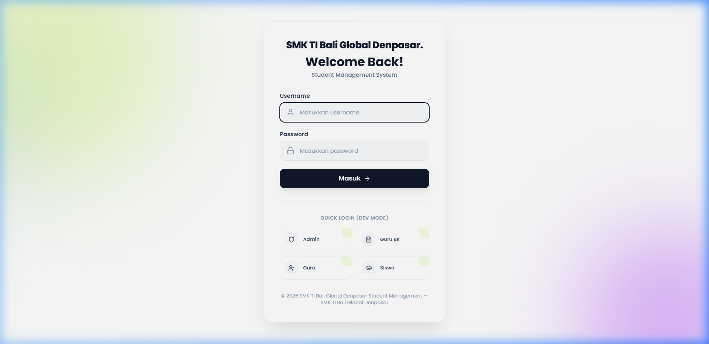
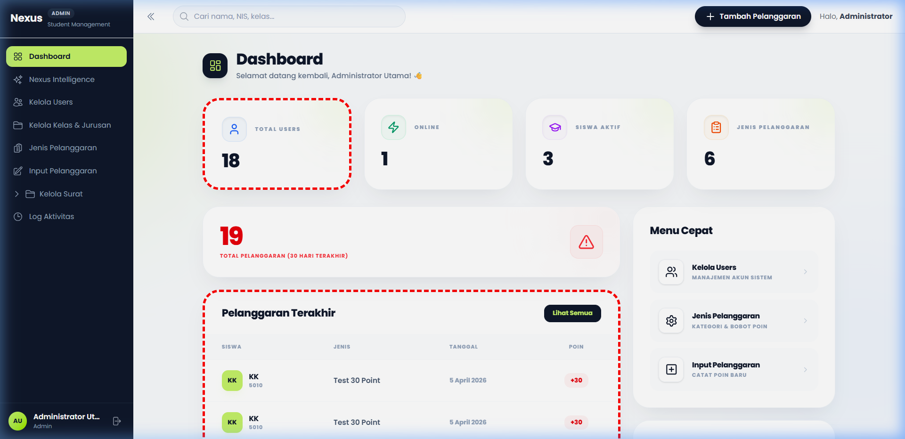
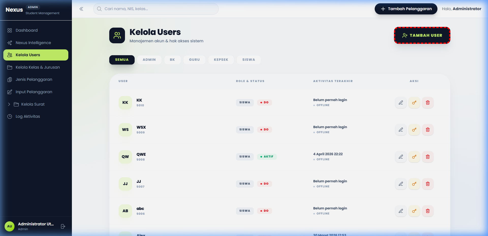
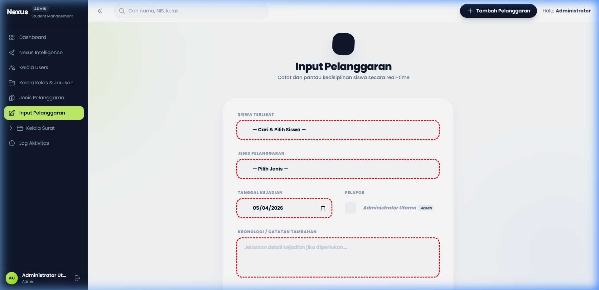
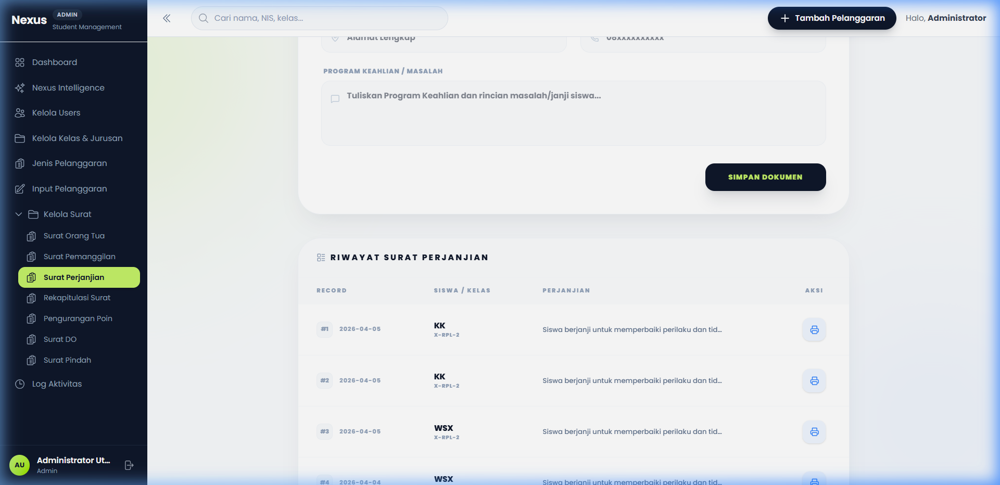
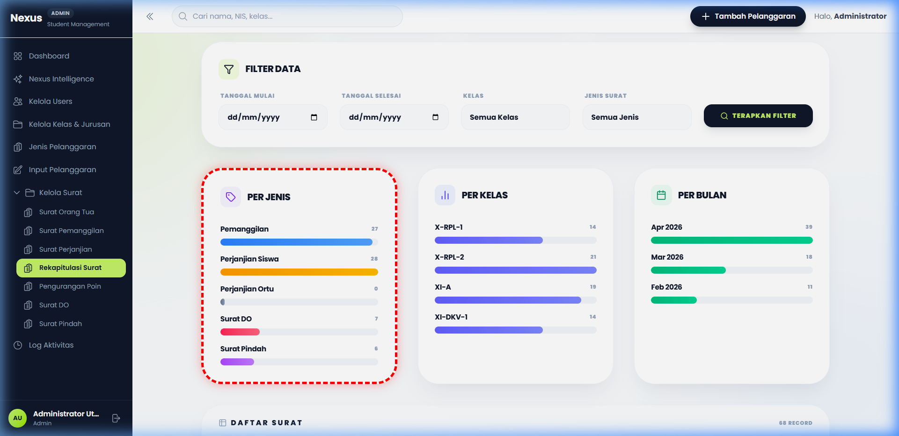
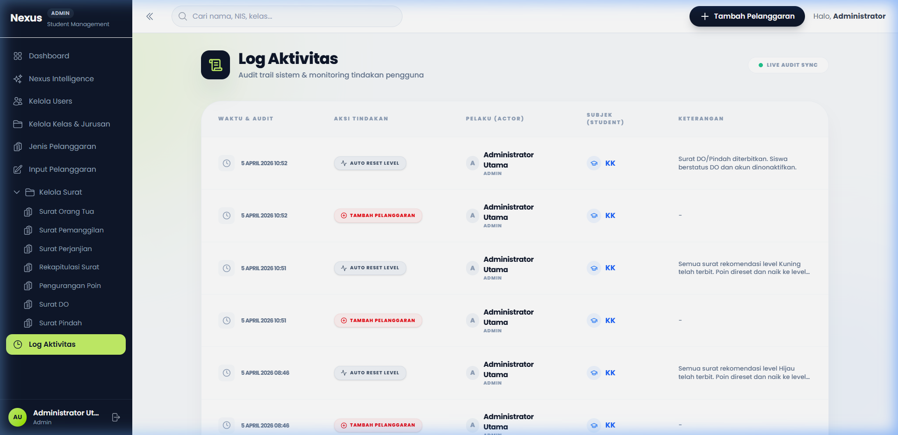

# PANDUAN PENGGUNAAN SiPoin
## Sistem Poin Pelanggaran Siswa - SMK TI Bali Global Denpasar

---

## 1. Halaman Login
Untuk masuk ke dalam sistem, silakan akses URL aplikasi lalu Anda akan melihat tampilan login.

1.  Masukkan **Username** dan **Password** Anda.
2.  (Untuk Developer) Tersedia menu **Quick Login** di bagian bawah untuk akses cepat ke berbagai Role.
3.  Klik tombol **Masuk**.

---

## 2. Dashboard Admin
Setelah login sebagai Admin, Anda akan disambut oleh ringkasan statistik sistem.

*   **Total Users (Kotak Merah Atas):** Menunjukkan jumlah guru dan siswa yang terdaftar.
*   **Pelanggaran Terakhir (Kotak Merah Bawah):** Daftar pelanggaran terbaru yang baru saja diinput oleh Guru/BK.
*   **Menu Cepat:** Shortcut di sisi kanan untuk akses fitur paling sering digunakan.

---

## 3. Kelola User (Manajemen Akun)
Halaman ini digunakan untuk menambah, mengedit, atau menghapus akun (Admin, BK, Guru, Siswa).

*   Klik tombol **[+ TAMBAH USER]** (kotak merah) untuk mendaftarkan akun baru.
*   Gunakan filter di bagian atas untuk mencari user berdasarkan peran.

---

## 4. Input Pelanggaran
Ini adalah inti dari aplikasi, di mana Guru atau BK mencatat poin pelanggaran siswa.

1.  **Siswa Terlibat:** Pilih nama siswa dari dropdown yang tersedia.
2.  **Jenis Pelanggaran:** Pilih kategori pelanggaran (otomatis menentukan poin).
3.  **Tanggal:** Tentukan kapan kejadian berlangsung.
4.  **Kronologi:** Tuliskan catatan detail kejadian.
5.  Klik **SIMPAN PELANGGARAN** untuk memproses.

---

## 5. Kelola Surat & Cetak (Cetak Dokumen)
Fitur unggulan untuk menerbitkan surat peringatan (Perjanjian, Pemanggilan, DO, Pindah).

*   Daftar surat yang sudah diterbitkan akan muncul di tabel.
*   Klik icon **Cetak** (kotak merah kecil) untuk membuka jendela *Print Preview* yang sudah terformat rapi dan siap diprint ke kertas fisik/PDF.

---

## 6. Rekapitulasi & Statistik
Gunakan menu ini untuk melihat performa kedisiplinan sekolah secara keseluruhan.

*   **Grafik Distribusi:** Menampilkan kategori pelanggaran terbanyak.
*   **Filter Data:** Anda dapat menarik rekap berdasarkan rentang tanggal atau kelas tertentu.

---

## 7. Log Aktivitas
Semua tindakan di dalam sistem tercatat secara otomatis demi transparansi.

*   Melihat siapa saja yang baru login.
*   Melacak input pelanggaran dan siapa yang mencatatnya.
*   Melihat logs otomatisasi sistem (seperti reset poin otomatis).

---

> **Catatan Final:** Panduan ini disusun menggunakan data asli dari sistem SiPoin versi 1.0. Jika terjadi kendala sistem, hubungi Administrator.
