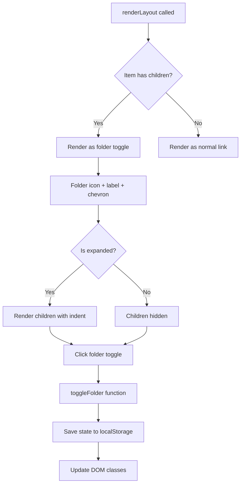

# Plan: Sidebar Nested Menu untuk Kelola Surat

## Tujuan
Mengubah menu sidebar "Kelola Surat" menjadi folder yang expandable, menampilkan berbagai jenis surat sebagai child items di dalamnya.

## Struktur Menu yang Diinginkan

```
Kelola Surat (folder, expandable)
├── Surat Orang Tua
├── Surat Pemanggilan
├── Surat Perjanjian
├── Pengurangan Poin
├── Surat DO
└── Surat Pindah
```

## Analisis Kode Saat Ini

### 1. Menu Definition (`public/js/app.js:310-354`)
```javascript
const menus = {
    admin: [
        { label: 'Kelola Surat', icon: 'folder', href: '/bk/surat' },
        { label: 'Surat Orang Tua', icon: 'clipboard', href: '/bk/surat-orangtua' },
        // ... semua surat flatten
    ],
    bk: [ ... same structure ... ]
};
```

### 2. Sidebar Rendering (`public/js/app.js:417-430`)
- Menu items di-render menggunakan `.map()` sederhana
- Tidak ada support untuk nested items

### 3. CSS Styles (`public/js/app.js:47-67`)
- `.sidebar-link` untuk style link normal
- `.sidebar-link.active` untuk link aktif
- Tidak ada CSS untuk nested items

---

## Langkah Implementasi

### Step 1: Modifikasi Menu Structure
Tambahkan property `children` untuk item yang memiliki sub-items:
```javascript
{ 
    label: 'Kelola Surat', 
    icon: 'folder', 
    href: '/bk/surat',
    children: [
        { label: 'Surat Orang Tua', icon: 'clipboard', href: '/bk/surat-orangtua' },
        { label: 'Surat Pemanggilan', icon: 'clipboard', href: '/bk/surat-pemanggilan' },
        // ...
    ]
}
```

### Step 2: Update Sidebar Rendering Logic
Modifikasi render `nav` section untuk:
- Deteksi apakah item memiliki `children`
- Render sebagai expandable folder dengan toggle icon
- Render child items dengan indentasi

### Step 3: Tambah CSS untuk Nested Menu
```css
/* Folder menu (parent dengan children) */
.sidebar-folder { ... }

/* Expanded state */
.sidebar-folder.expanded .folder-icon { transform: rotate(90deg); }

/* Child items */
.sidebar-child { padding-left: 2.5rem; }
```

### Step 4: Tambah JavaScript Toggle
- Fungsi `toggleFolder(clickedElement)` untuk expand/collapse
- Simpan state di localStorage agar konsisten saat refresh

### Step 5: Update Semua Role Menus
- `admin`: Hapus surat items dari root, masukkan ke `children`
- `bk`: Same pattern

---

## Mermaid Diagram: Alur Render Sidebar



---

## File yang Perlu Dimodifikasi

| File | Perubahan |
|------|-----------|
| `public/js/app.js` | Menu structure, render logic, CSS, JS toggle |

---

## Preview Hasil

**Sebelum:**
```
📁 Kelola Surat
📄 Surat Orang Tua
📄 Surat Pemanggilan
...
```

**Sesudah:**
```
📁 Kelola Surat ▼
   📄 Surat Orang Tua
   📄 Surat Pemanggilan
   📄 Surat Perjanjian
   📄 Pengurangan Poin
   📄 Surat DO
   📄 Surat Pindah
```

---

## Catatan
- Content halaman surat sudah benar semua, hanya modifikasi sidebar navigation
- Expand/collapse state persisted di localStorage
- Compatible dengan existing collapsed sidebar mode